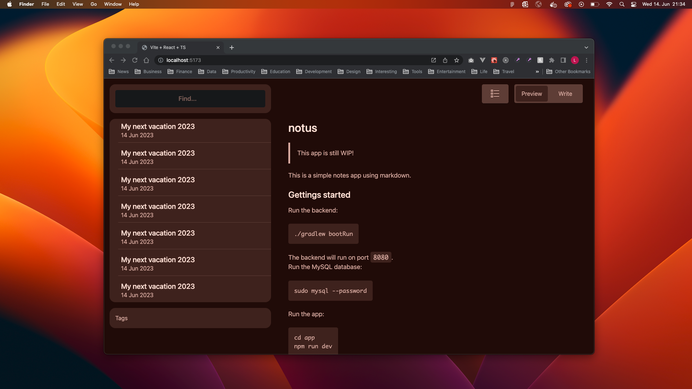

# notus



## This app is still WIP and not usable yet…

This is a simple notes app using markdown.

## Gettings started

Run the backend:

```sh
cd backend
uvicorn main:app --reload
```

The backend will run on port `8000`.

Run the app:

```sh
cd app
npm run dev
```

Login to the MySQL monitor via:

```sh
mysql -u root -p
```

## ToDos

- [ ] Add API to add, edit and delete notes connected to a user.
- [ ] Connect endpoints with react app.
- [ ] Show tags in app.
- [ ] Add syntax highlighting to preview.
- [ ] Add search feature
- [ ] More do be added…
